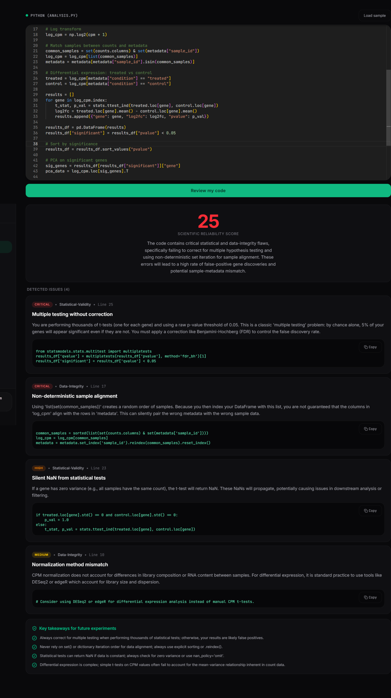
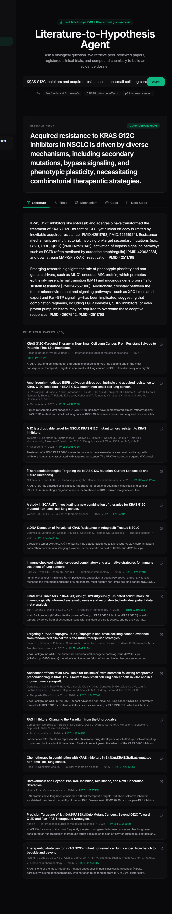

# BioAI Toolkit

> AI-powered code review and literature research for biotechnology students.

[](https://github.com/jyant144530-hash/bioai-toolkit/actions/workflows/build.yml)
[](https://opensource.org/licenses/MIT)
[](https://nextjs.org)

## The Problem

Biotechnology students increasingly write Python for lab data — qPCR analysis, RNA-seq, plate reader parsing — but they lack formal software engineering training. Silent bugs corrupt scientific results without crashing:

- **Division by zero** in fold-change calculations produces `inf` and invalidates results
- **Missing FDR correction** in differential expression turns 1,000 noise genes into "significant hits"
- **Sample index misalignment** from non-deterministic `set()` iteration silently pairs treated samples with control metadata
- **Zero-variance t-tests** return `NaN` that propagates through PCA and clustering

Separately, preliminary literature reviews consume hours of manual PubMed searching that could be automated.

## What It Does

**Code Review Bot** — Reviews Python bioinformatics scripts and catches silent scientific bugs generic AI misses. The prompt enforces a mandatory pre-flight scan for five categories of error: division without zero-check, hardcoded paths, missing multiple-testing correction, sample-order misalignment, and silent NaN from statistical tests.

**Literature-to-Hypothesis Agent** — Takes a research question, queries Europe PMC, ClinicalTrials.gov, and PubChem in parallel, and synthesizes a cited report in under 60 seconds. Every PMID links to a real paper.

## Screenshots

### Code Review Bot


### Literature-to-Hypothesis Agent


## Architecture

Client (Next.js App Router)
  ↓
API Routes (Node runtime, 60s max)
  ├── /api/review    → Gemini (fallback chain) → Supabase
  └── /api/research  → 3-step pipeline:
                        1. Entity extraction (Gemini)
                        2. Parallel queries to Europe PMC + ClinicalTrials.gov + PubChem
                        3. Synthesis (Gemini) with inline citations

## Tech Stack

| Layer | Choice |
|---|---|
| Framework | Next.js 15 (App Router), TypeScript |
| Styling | Tailwind CSS v4 + custom dark theme |
| Editor | Monaco (`@monaco-editor/react`) |
| Auth + DB | Supabase (Postgres + Auth + RLS) |
| AI | Google Gemini with model fallback chain |
| Literature | Europe PMC REST API |
| Trials | ClinicalTrials.gov API v2 |
| Chemistry | PubChem PUG REST |
| Payments | Stripe (stubbed) |
| Deploy | Vercel |

## Getting Started

### Prerequisites

- Node.js 20+
- A Supabase project (free)
- A Google AI Studio API key (free)

### Setup

1. Clone the repo:
   ```bash
   git clone https://github.com/jyant144530-hash/bioai-toolkit.git
   cd bioai-toolkit
   npm install
   ```

2. Create a Supabase project and run `supabase/schema.sql` in the SQL editor.

3. In Supabase, disable "Confirm email" under Authentication → Providers → Email.

4. Copy `.env.example` to `.env.local` and fill in your real values.

5. Run the dev server:
   ```bash
   npm run dev
   ```

6. Open `http://localhost:3000/login` and sign up.

### Testing the Code Review Bot

Paste this into the editor at `/dashboard/code-review`:

```python
import pandas as pd

df = pd.read_csv("/Users/me/Desktop/plate_reader_export.csv")
control = df[df["sample"] == "control"]
treated = df[df["sample"] == "treated"]

fold_change = treated["signal"].mean() / control["signal"].mean()
print("Fold change:", fold_change)
```

Expected: score ~20/100, three issues — division by zero (critical), hardcoded path (high), unsafe CSV loading (medium).

### Testing the Research Agent

Search for `Metformin and Alzheimer's disease`. Expected: ~15 real papers with PMIDs, 10 clinical trials, synthesis with inline citations in 30–90 seconds.

## Why the Prompts Are in a Separate File

`lib/prompts.ts` is the product. Every prompt is version-controlled and iterated based on real test failures. The current version catches five categories of silent scientific bug that generic LLMs miss.

## Status

Working v1. Freemium tier: 5 reviews + 3 reports per month. Student Pro (₹199/month) planned.

## Roadmap

- [ ] Real Stripe integration
- [ ] Past reviews and reports history
- [ ] PDF export for research reports
- [ ] GitHub integration — auto-review PRs
- [ ] R script support
- [ ] Jupyter notebook support

## License

MIT — see [LICENSE](./LICENSE).

## Author

Jyant — BSc Biotechnology
[Your LinkedIn URL] · [Your email]
